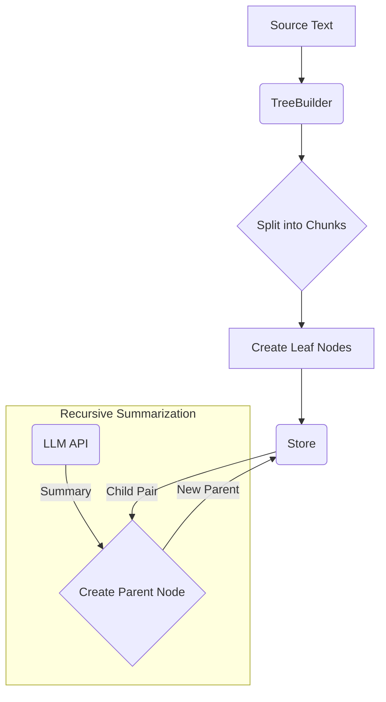
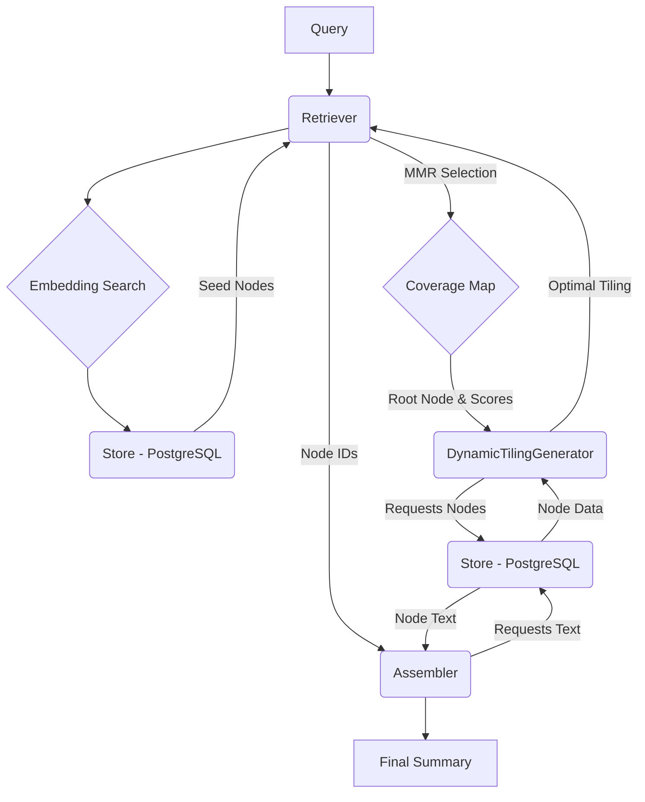

# RagZoom System Architecture

**Last Verified**: November 2025

This document provides a high-level overview of the RagZoom system, its core components, and the flow of data during indexing and querying.

> **Migration Note**: As of January 2025, RagZoom has completed its transition from the legacy "Zoom-Lens" algorithm to a modern Dynamic Programming approach. This migration eliminated ~5,400 lines of legacy code while maintaining all functionality. The system now uses a single, well-tested algorithmic path documented in detail below.

## 1. Core Concepts

### 1.1. The Node Tree

The central data structure in RagZoom is a binary tree of **Nodes**.

-   **Leaf Nodes (Depth 0):** These are created by splitting a source document into chunks of a configured token size. Each leaf node contains raw text from the document.
-   **Parent Nodes (Depth > 0):** Each parent node is a summary of its two children. This summary is generated by an LLM and stored as a single coherent text. This process is applied recursively, creating a hierarchical summary of the entire document, with the root node representing a synopsis of the whole text.
-   **Structural Navigation Only:** Binary path strings are no longer persisted on nodes. Depth and ancestry are computed on demand via structural traversal with aggressive caching in the `TreeNavigator` service.
-   **Spans:** Every node has a `(span_start, span_end)` attribute, representing the character offsets in the original document that it covers. A parent's span is the union of its children's spans.

### 1.2. The Tiling

A **Tiling** is the final output of the retrieval process. It is a "correct-by-construction" list of node IDs that:
1.  Are ordered chronologically by their span.
2.  Completely cover the source document's span without any gaps or overlaps.
3.  Adhere to a specified token budget.

Each node in the tiling is treated as an atomic unit - the entire node's content is included. The DP algorithm chooses between using a parent node or recursing to its children for finer detail.

For an in-depth explanation of how tilings are generated using the Dynamic Programming algorithm, see [The Tiling Algorithm: Deep Dive](deep-dives/tiling-algorithm.md).

### 1.3. Tree Invariants

The RagZoom system maintains several critical invariants to ensure correct operation:

- **Left-Balanced Tree Requirement**: Trees must be left-balanced, where internal nodes have either one left child or two children. Parent spans must equal the union of child spans to maintain complete document coverage.
- **Equal Leaf Depth**: All leaf nodes must be at the same (maximal) depth from the root. This ensures consistent abstraction levels throughout the tree and prevents mixing raw text with summaries at different heights. When there's an odd number of nodes at any level, a single-child parent is created rather than promoting the odd node.
- **Sibling Adjacency**: Sibling nodes must have adjacent spans with no gaps between them. Specifically, for any node with two children, the left child's span_end must equal the right child's span_start. This ensures the tree structure directly supports gap-free tilings.
- **Coverage Tree Completeness**: When building a coverage tree for retrieval, the system must include siblings to maintain coverage completeness. If a node is selected, its sibling must also be included (if it exists) to ensure the parent can be used as a fallback option.
- **Span Coverage Invariant**: Every parent node's span must equal the union of its children's spans, ensuring no gaps in document coverage.

## 2. System Components

The system is composed of several key modules that work together.

-   **`ragzoom.index.TreeBuilder`**: Orchestrates the patch engine that builds both full-document and incremental append patches. It splits text into leaves, constructs `TreePatch` objects, and drives the LLM to generate parent summaries while preserving tree invariants and document/version metadata.

-   **Storage Layer (StorageBackend + DocumentStore)**: The persistence layer is abstracted behind a `StorageBackend` protocol.
    - SQLiteStorageBackend (default for development) stores nodes in `data/sqlite.db` and vectors in a local index (Chroma in `data/chroma/` or a pure‑Python index).
    - PostgresStorageBackend (for production/perf) uses PostgreSQL with pgvector for embeddings via repositories and a `DatabaseManager`.
    - All application code creates a per‑document `DocumentStore` via `store.for_document(doc_id)` to enforce strict document isolation.

-   **`ragzoom.dynamic_tiling.DynamicTilingGenerator`**: This is the core "brain" of the retrieval logic. It implements a dynamic programming algorithm to construct the optimal tiling. The algorithm recursively decomposes the problem, choosing at each node whether to use the parent node or recurse into children for higher detail. Budget is split proportionally based on relevance scores.

-   **`ragzoom.dynamic_tiling.GreedyTilingGenerator`**: An alternative tiling strategy that walks the tree top-down, making locally optimal decisions. Faster than DP with lower memory overhead, useful for very large documents. Selected via `tiling_strategy="greedy"`.

-   **`ragzoom.dynamic_tiling.AsyncDynamicTilingGenerator`**: An async version of the DP tiling generator that provides fork-join parallelism for independent subtree processing. When both left and right children exist, the algorithm can process them concurrently using asyncio tasks, providing 2-4x speedup on multi-core systems for trees with sufficient size. Parallelization is threshold-controlled (default: 10+ nodes) to avoid overhead on small subtrees.

For a comprehensive technical deep dive into the tiling algorithm, see [The Tiling Algorithm: Deep Dive](deep-dives/tiling-algorithm.md).

-   **`ragzoom.retrieve.Retriever`**: Orchestrates the querying process. It takes a user query, generates an embedding, and uses the `Store` to find relevant "seed" nodes via vector search. It applies MMR (Maximal Marginal Relevance) for diversity, then invokes the configured tiling generator (DP, Greedy, or async DP) to build the final tiling. Supports `recent_verbatim_token_budget` for including recent content without summarization - useful for conversation logs where the most recent messages should appear verbatim.

-   **`ragzoom.assemble.Assembler`**: The final step in the pipeline. It takes the tiling (a list of node IDs) produced by the retriever and assembles the final summary text by concatenating the text content of each node. **STATUS: IMPLEMENTED** - Only DP-based assembly is supported; legacy assembly has been removed.

-   **`ragzoom.cli` & `ragzoom.api`**: The user-facing interfaces for interacting with the system, providing command-line and REST API access, respectively.

## 3. Data Flow

### Indexing Flow

### Querying Flow

**Note**: When in budget-only mode, the Retriever calculates a conservative `num_seeds` based on the average token cost of all nodes in the document (with a 25% safety buffer).

## 4. Key Design Principles

### 4.1. Correct-by-Construction

The DP tiling algorithm produces valid outputs in a single pass, eliminating the need for multi-stage corrective pipelines. This approach reduces bugs and makes the system more predictable.

### 4.2. Character-Based Spans

All spans use character coordinates (not tokens) for stability and verifiability. This allows exact mapping back to source document positions.

### 4.3. Async Indexing, Sync Retrieval

- **Indexing**: Uses AsyncOpenAI for high concurrency when building trees
  - Concurrent processing of node pairs with configurable semaphore (default: 10)
  - Batch embedding requests (up to 100 texts per API call)
  - Progress tracking with optional progress bars
- **Retrieval**: Uses synchronous OpenAI client as queries are typically single-threaded
  - Async dirty node refresh before retrieval
  - Pre-loads all nodes in coverage map to minimize database queries

### 4.4. Document Isolation

Each document is completely isolated with its own namespace. Queries require explicit document IDs to prevent cross-document contamination.

## 5. Configuration

Key configuration parameters that affect system behavior:

| Parameter | Default | Description | Status |
|-----------|---------|-------------|---------|
| `budget_tokens` | 8000 | Maximum tokens in final summary | IMPLEMENTED |
| `leaf_tokens` | 200 | Target tokens per leaf chunk | IMPLEMENTED |
| `mmr_lambda` | 0.7 | MMR diversity vs relevance trade-off | IMPLEMENTED |
| `tiling_strategy` | "dp" | Tiling algorithm: "dp" or "greedy" | IMPLEMENTED |
| `recent_verbatim_token_budget` | 0 | Token budget for verbatim recent leaves | IMPLEMENTED |
| `enable_slope_cap` | True | Limit depth differences between adjacent nodes | **NOT IMPLEMENTED** |
| `slope_cap_size` | 1 | Maximum depth difference | **NOT IMPLEMENTED** |
| `enable_smoothing` | False | Add transitions between nodes | **NOT IMPLEMENTED** |

For complete configuration documentation including all parameters and environment variables, see [API Reference - Configuration](api-reference.md#configuration-parameters).

## 6. Implementation Status

### Currently Implemented
- ✅ DP tiling algorithm with memoization
- ✅ Greedy tiling algorithm (alternative strategy)
- ✅ Budget-aware node selection
- ✅ MMR diversity in seed selection
- ✅ Verbatim budget for recent content (conversation logs)
- ✅ Document isolation and namespacing
- ✅ Async tree building with progress tracking
- ✅ LRU caching for performance
- ✅ Validation framework

### Not Yet Implemented
- ❌ Slope cap enforcement between adjacent nodes
- ❌ Smoothing pass for readability
- ❌ Mass-based relevance propagation
- ❌ Proportional budget allocation based on propagated mass

## 7. Performance Characteristics

- **Tree Building**: O(n) API calls where n = number of nodes
- **Retrieval**: O(n × b) where b = distinct budget values (with memoization)
- **Vector Search**: Typically < 100ms for databases with thousands of nodes
- **Assembly**: O(k) where k = number of nodes in tiling

## 8. Common Patterns

### Indexing a Document
1. Text splitter creates leaf nodes
2. TreeBuilder builds a `TreePatch` (full document or append) and drives the LLM to produce summaries bottom-up
3. Each parent summarizes its children into a single coherent text while the patch tracks neighbor and span updates
4. Store persists nodes, embeddings, and document/version metadata in a single transaction

### Querying a Document
1. Query embedding generated
2. Vector search finds relevant seed nodes
3. MMR applied for diversity
4. DP algorithm builds optimal tiling
5. Assembler concatenates node texts

## 9. Future Architecture Considerations

1. **Streaming Assembly**: Stream nodes as they're computed
2. **Parallel DP Evaluation**: Compute left/right subproblems concurrently
3. **Pre-computed Tilings**: Cache common budget allocations
4. **Multi-document Queries**: Extend to handle cross-document retrieval

## 10. See Also

- [Tiling Algorithm Deep Dive](deep-dives/tiling-algorithm.md) - Comprehensive technical explanation of the DP algorithm
- [Developer Guide](developer-guide.md) - Development environment setup and best practices
- [API Reference](api-reference.md) - Complete CLI and Python API documentation
- [Vision Document](vision.md) - Future features and architectural evolution 
