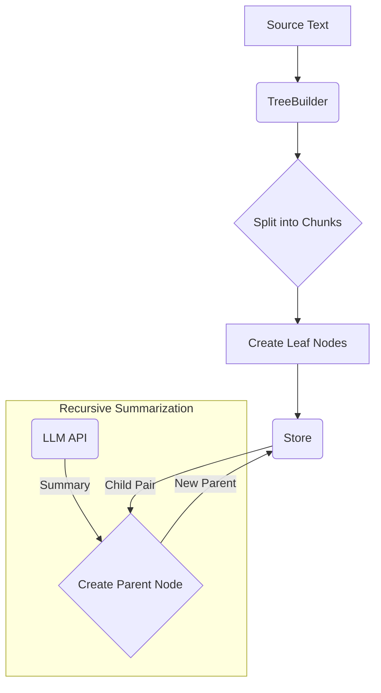
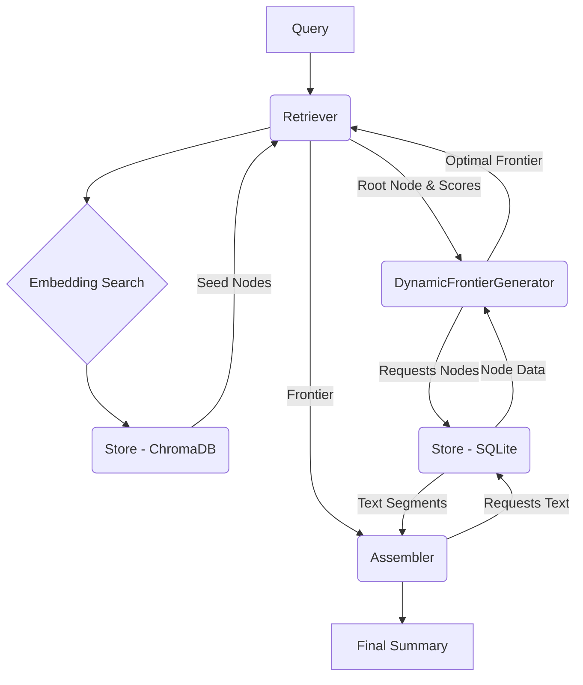

# RagZoom System Architecture

This document provides a high-level overview of the RagZoom system, its core components, and the flow of data during indexing and querying.

## 1. Core Concepts

### 1.1. The Node Tree

The central data structure in RagZoom is a binary tree of **Nodes**.

-   **Leaf Nodes (Depth 0):** These are created by splitting a source document into chunks of a configured token size. Each leaf node contains raw text from the document.
-   **Parent Nodes (Depth > 0):** Each parent node is a summary of its two children. This summary is generated by an LLM. This process is applied recursively, creating a hierarchical summary of the entire document, with the root node representing a synopsis of the whole text.
-   **Spans:** Every node has a `(span_start, span_end)` attribute, representing the character offsets in the original document that it covers. A parent's span is the union of its children's spans.

### 1.2. The Frontier

A **Frontier** is the final output of the retrieval process. It is a "correct-by-construction" list of `SummarySegment` objects that:
1.  Are ordered chronologically by their span.
2.  Completely cover the source document's span without any gaps or overlaps.
3.  Adhere to a specified token budget.

A `SummarySegment` is always a "half-node"—the part of a parent's summary that corresponds to either its left or right child.

## 2. System Components

The system is composed of several key modules that work together.

-   **`ragzoom.index.TreeBuilder`**: The component responsible for building the node tree from a source document. It splits the text, creates leaf nodes, and then recursively calls an LLM to generate parent summaries in a bottom-up fashion.

-   **`ragzoom.store.Store`**: The persistence layer. It uses a dual-backend approach:
    -   **SQLite (`sqlalchemy`):** Stores the tree structure, node metadata (ID, parent/child relationships, spans, depth), and the summary text.
    -   **ChromaDB (`chromadb`):** Stores vector embeddings of the node summaries for efficient semantic search.

-   **`ragzoom.dynamic_frontier.DynamicFrontierGenerator`**: This is the core "brain" of the retrieval logic. It implements a dynamic programming algorithm to construct the optimal frontier. It traverses the node tree from the top down, making quality-based decisions at each node to either use that node's summary segment or recurse deeper to get a more detailed (and potentially higher-quality) frontier from its children, all while respecting the token budget.

-   **`ragzoom.retrieve.Retriever`**: Orchestrates the querying process. It takes a user query, generates an embedding, and uses the `Store` to find a set of relevant "seed" nodes. It then invokes the `DynamicFrontierGenerator` to build the final frontier based on these seed nodes and the budget.

-   **`ragzoom.assemble.Assembler`**: The final step in the pipeline. It takes the `Frontier` (a list of `SummarySegment` objects) produced by the retriever and stitches the final summary text together. With the new DP-based frontier, its role is greatly simplified to just concatenating text segments.

-   **`ragzoom.cli` & `ragzoom.api`**: The user-facing interfaces for interacting with the system, providing command-line and REST API access, respectively.

## 3. Data Flow

### Indexing Flow

### Querying Flow (DP Mode)

