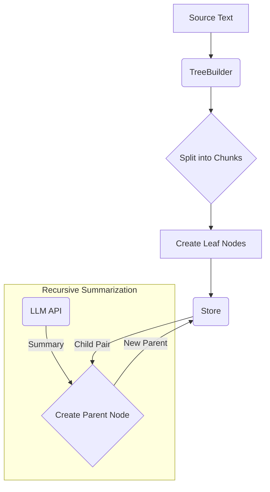
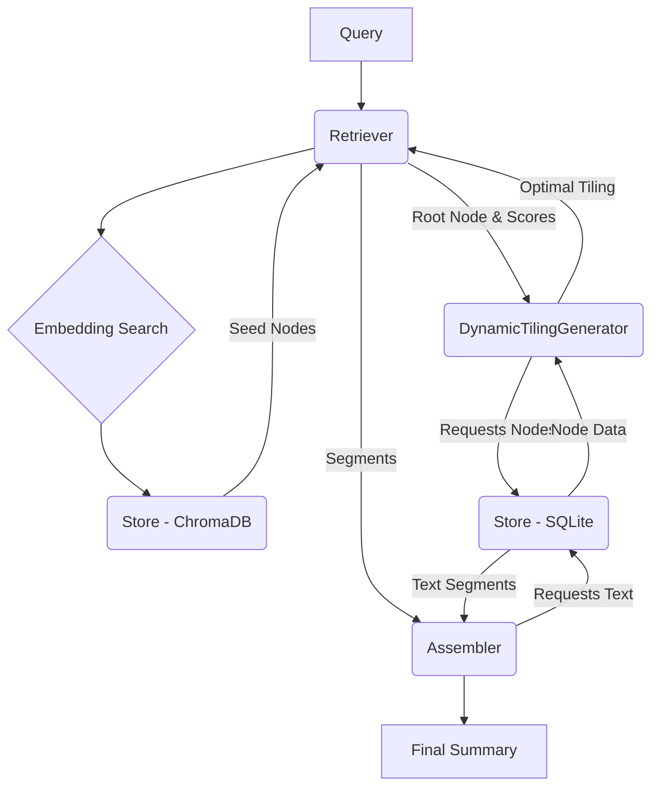

# RagZoom System Architecture

**Last Verified**: January 2025

This document provides a high-level overview of the RagZoom system, its core components, and the flow of data during indexing and querying.

## 1. Core Concepts

### 1.1. The Node Tree

The central data structure in RagZoom is a binary tree of **Nodes**.

-   **Leaf Nodes (Depth 0):** These are created by splitting a source document into chunks of a configured token size. Each leaf node contains raw text from the document.
-   **Parent Nodes (Depth > 0):** Each parent node is a summary of its two children. This summary is generated by an LLM. This process is applied recursively, creating a hierarchical summary of the entire document, with the root node representing a synopsis of the whole text.
-   **Spans:** Every node has a `(span_start, span_end)` attribute, representing the character offsets in the original document that it covers. A parent's span is the union of its children's spans.

### 1.2. The Tiling

A **Tiling** is the final output of the retrieval process. It is a "correct-by-construction" list of `Segment` objects that:
1.  Are ordered chronologically by their span.
2.  Completely cover the source document's span without any gaps or overlaps.
3.  Adhere to a specified token budget.

A `Segment` can be:
- **For leaf nodes**: The entire node (side = None)
- **For internal nodes**: Either the LEFT or RIGHT half, split at the `<<<MID>>>` delimiter

## 2. System Components

The system is composed of several key modules that work together.

-   **`ragzoom.index.TreeBuilder`**: The component responsible for building the node tree from a source document. It splits the text, creates leaf nodes, and then recursively calls an LLM to generate parent summaries in a bottom-up fashion.

-   **`ragzoom.store.Store`**: The persistence layer. It uses a dual-backend approach:
    -   **SQLite (`sqlalchemy`):** Stores the tree structure, node metadata (ID, parent/child relationships, spans, depth), and the summary text.
    -   **ChromaDB (`chromadb`):** Stores vector embeddings of the node summaries for efficient semantic search.
    -   **LRU Cache**: In-memory cache for frequently accessed nodes (default: 1000 nodes).

-   **`ragzoom.dynamic_tiling.DynamicTilingGenerator`**: This is the core "brain" of the retrieval logic. It implements a dynamic programming algorithm to construct the optimal tiling. The algorithm recursively decomposes the problem, choosing at each node whether to use the parent's segments or recurse into children for higher detail. Budget is split proportionally based on relevance scores.

-   **`ragzoom.retrieve.Retriever`**: Orchestrates the querying process. It takes a user query, generates an embedding, and uses the `Store` to find relevant "seed" nodes via vector search. It applies MMR (Maximal Marginal Relevance) for diversity, then invokes the `DynamicTilingGenerator` to build the final tiling based on these seed nodes and the budget.

-   **`ragzoom.assemble.Assembler`**: The final step in the pipeline. It takes the tiling (a list of `Segment` objects) produced by the retriever and assembles the final summary text. **STATUS: IMPLEMENTED** - Only DP-based assembly is supported; legacy assembly has been removed.

-   **`ragzoom.cli` & `ragzoom.api`**: The user-facing interfaces for interacting with the system, providing command-line and REST API access, respectively.

## 3. Data Flow

### Indexing Flow

### Querying Flow

## 4. Key Design Principles

### 4.1. Correct-by-Construction

The DP tiling algorithm produces valid outputs in a single pass, eliminating the need for multi-stage corrective pipelines. This approach reduces bugs and makes the system more predictable.

### 4.2. Character-Based Spans

All spans use character coordinates (not tokens) for stability and verifiability. This allows exact mapping back to source document positions.

### 4.3. Async Indexing, Sync Retrieval

- **Indexing**: Uses AsyncOpenAI for high concurrency when building trees
- **Retrieval**: Uses synchronous OpenAI client as queries are typically single-threaded

### 4.4. Document Isolation

Each document is completely isolated with its own namespace. Queries require explicit document IDs to prevent cross-document contamination.

## 5. Configuration

Key configuration parameters that affect system behavior:

| Parameter | Default | Description | Status |
|-----------|---------|-------------|---------|
| `budget_tokens` | 8000 | Maximum tokens in final summary | IMPLEMENTED |
| `leaf_tokens` | 200 | Target tokens per leaf chunk | IMPLEMENTED |
| `mmr_lambda` | 0.7 | MMR diversity vs relevance trade-off | IMPLEMENTED |
| `enable_slope_cap` | True | Limit depth differences between segments | **NOT IMPLEMENTED** |
| `slope_cap_size` | 1 | Maximum depth difference | **NOT IMPLEMENTED** |
| `enable_smoothing` | False | Add transitions between segments | **NOT IMPLEMENTED** |

## 6. Implementation Status

### Currently Implemented
- ✅ DP tiling algorithm with memoization
- ✅ Budget-aware segment selection
- ✅ MMR diversity in seed selection
- ✅ Document isolation and namespacing
- ✅ Async tree building with progress tracking
- ✅ LRU caching for performance
- ✅ Validation framework

### Not Yet Implemented
- ❌ Slope cap enforcement between segments
- ❌ Smoothing pass for readability
- ❌ Mass-based relevance propagation
- ❌ Proportional budget allocation based on propagated mass

## 7. Performance Characteristics

- **Tree Building**: O(n) API calls where n = number of nodes
- **Retrieval**: O(n × b) where b = distinct budget values (with memoization)
- **Vector Search**: Typically < 100ms for databases with thousands of nodes
- **Assembly**: O(k) where k = number of segments in tiling

## 8. Common Patterns

### Indexing a Document
1. Text splitter creates leaf nodes
2. TreeBuilder creates parents bottom-up
3. Each parent summarizes its children with `<<<MID>>>` delimiter
4. Store persists nodes and embeddings

### Querying a Document
1. Query embedding generated
2. Vector search finds relevant seed nodes
3. MMR applied for diversity
4. DP algorithm builds optimal tiling
5. Assembler concatenates segment texts

## 9. Future Architecture Considerations

1. **Streaming Assembly**: Stream segments as they're computed
2. **Parallel DP Evaluation**: Compute left/right subproblems concurrently
3. **Pre-computed Tilings**: Cache common budget allocations
4. **Multi-document Queries**: Extend to handle cross-document retrieval 